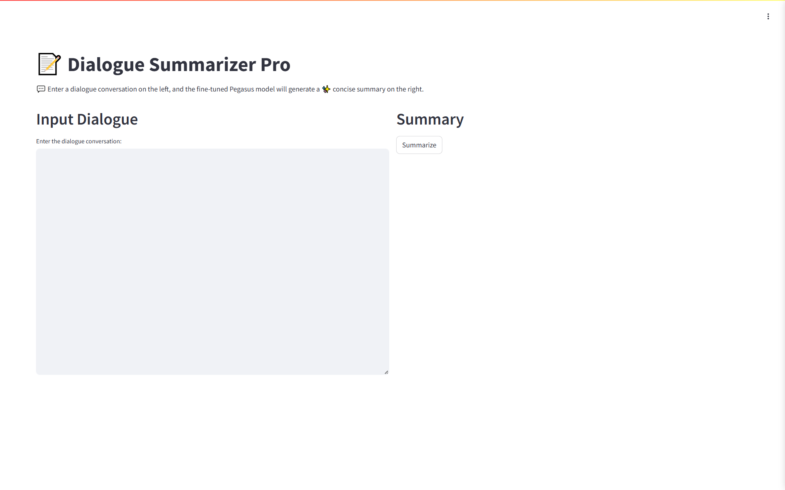
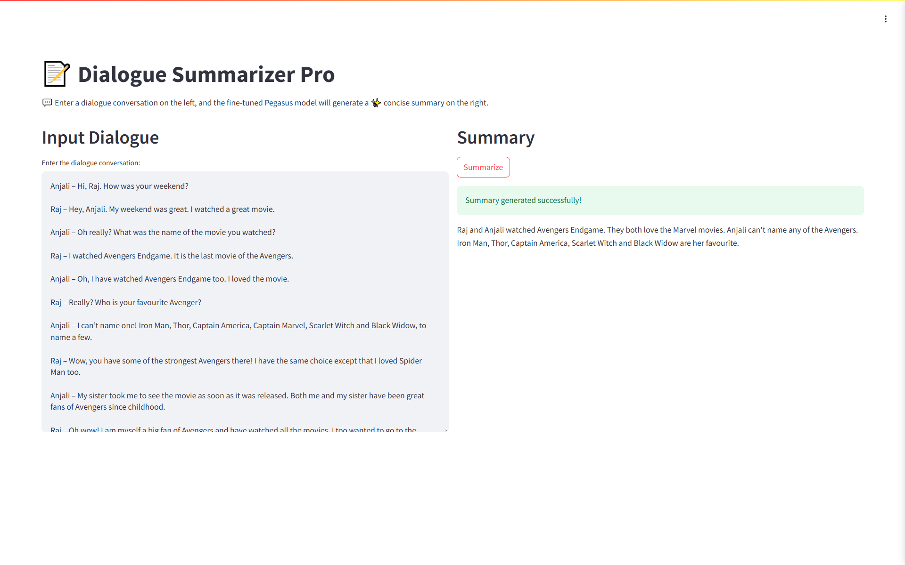
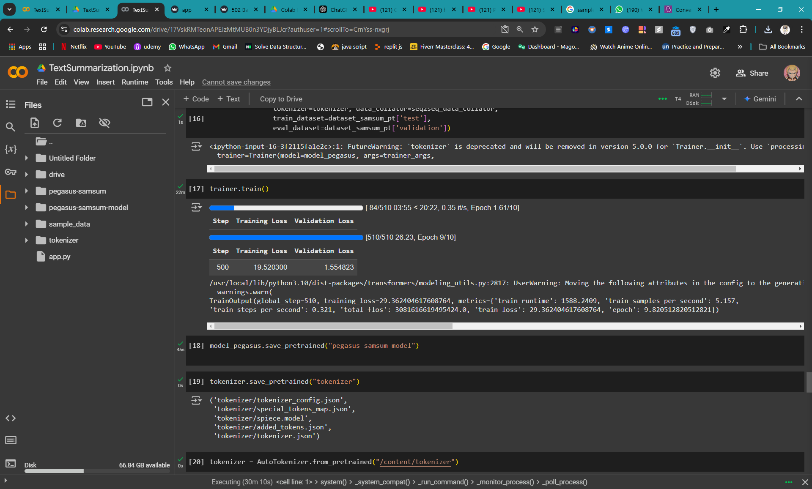

# Dialogue Summarization using Fine-Tuned Pegasus Model

This repository contains a fine-tuned **Pegasus** model for dialogue summarization. The model has been trained on a custom dataset using Google Colab for leveraging GPU capabilities. Additionally, a **Streamlit** application has been developed to allow users to upload conversations and generate concise summaries.

---

## Features

- Fine-tuned **Pegasus model** for high-quality dialogue summarization.
- Intuitive **Streamlit web interface** for uploading conversations and retrieving summaries.
- Custom dataset used for training to ensure domain-specific accuracy.

---

## Requirements

- Python 3.8+
- Google Colab (for training)
- Streamlit (for application deployment)
- Required Python Libraries:
  - transformers
  - torch
  - streamlit
  - pandas
  - numpy


---


## Screenshots

### Streamlit Application Interface


### Uploaded Conversation with Generated Summary


### Colab Training with loss


---
## Setup and Installation

### Clone the Repository
```bash
$ git clone https://github.com/meghanshgarjala/DIALOGUE_SUMMARIZER.git
$ cd dialogue-summarization-pegasus
```

### Install Dependencies
```bash
$ pip install -r requirements.txt
```

### Run the Streamlit Application
```bash
$ streamlit run app.py
```

---

## Training

The model was fine-tuned on a custom dataset using **Google Colab** to utilize GPU resources. 

### Steps to Train:
1. Upload your dataset to Google Colab.
2. Use the Hugging Face `transformers` library for fine-tuning the Pegasus model.
3. Save the fine-tuned model to a directory for use in the Streamlit application.

Code snippet for training:
```python
from transformers import PegasusTokenizer, PegasusForConditionalGeneration
from transformers import Trainer, TrainingArguments

# Load model and tokenizer
model_ckpt="google/pegasus-cnn_dailymail"

tokenizer=AutoTokenizer.from_pretrained(model_ckpt)

model_pegasus=AutoModelForSeq2SeqLM.from_pretrained(model_ckpt).to(device)
# Load dataset
# (Ensure your dataset is preprocessed for training)
train_dataset = ...

# Training arguments


trainer_args=TrainingArguments(
    output_dir='pegasus-samsum', num_train_epochs=10, warmup_steps=500,
    per_device_train_batch_size=1, per_device_eval_batch_size=1,
    weight_decay=0.01, logging_steps=10,
    evaluation_strategy='steps', eval_steps=500, save_steps=1e6,
    gradient_accumulation_steps=16,
    report_to='none'
)

# Trainer
trainer=Trainer(model=model_pegasus, args=trainer_args,
                tokenizer=tokenizer, data_collator=seq2seq_data_collator,
                train_dataset=dataset_samsum_pt['test'],
                eval_dataset=dataset_samsum_pt['validation'])

trainer.train()
```

---

## Streamlit Application

The Streamlit app allows users to upload text conversations (in `.txt` format) and generate a summary using the fine-tuned Pegasus model.

### Key Features:
- Simple and intuitive file upload interface.
- Real-time summarization using the model.

### How to Use:
1. Run the Streamlit app.
2. Upload a conversation file.
3. Click on **Generate Summary** to see the result.

---


## How It Works

1. The user uploads a conversation containing a conversation.
2. The Streamlit app reads the conversation and preprocesses the text.
3. The fine-tuned Pegasus model generates a concise summary of the conversation.
4. The summary is displayed in the app interface.

---

## License

This project is licensed under the MIT License. See the [LICENSE](LICENSE) file for details.

---

## Acknowledgments

- [Hugging Face Transformers](https://huggingface.co/transformers/)
- [Streamlit Documentation](https://docs.streamlit.io/)
- Google Colab for providing GPU resources.
